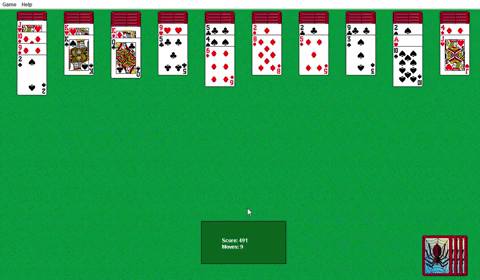
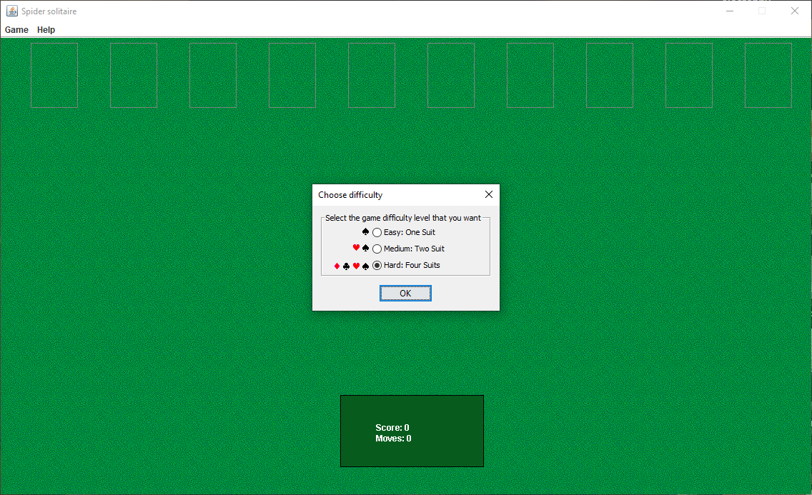
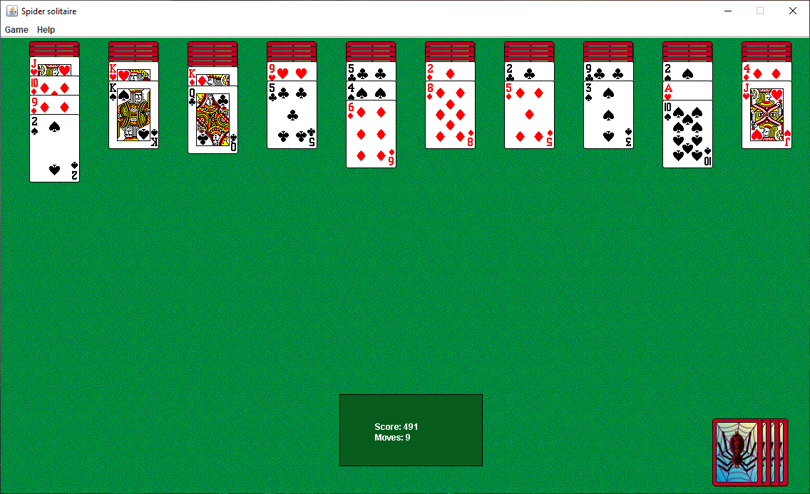
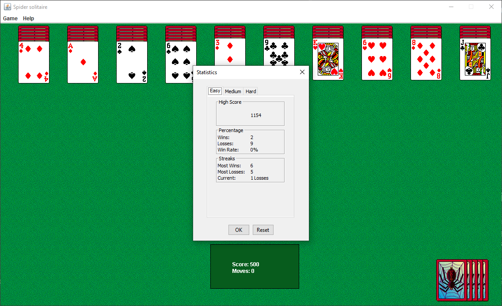
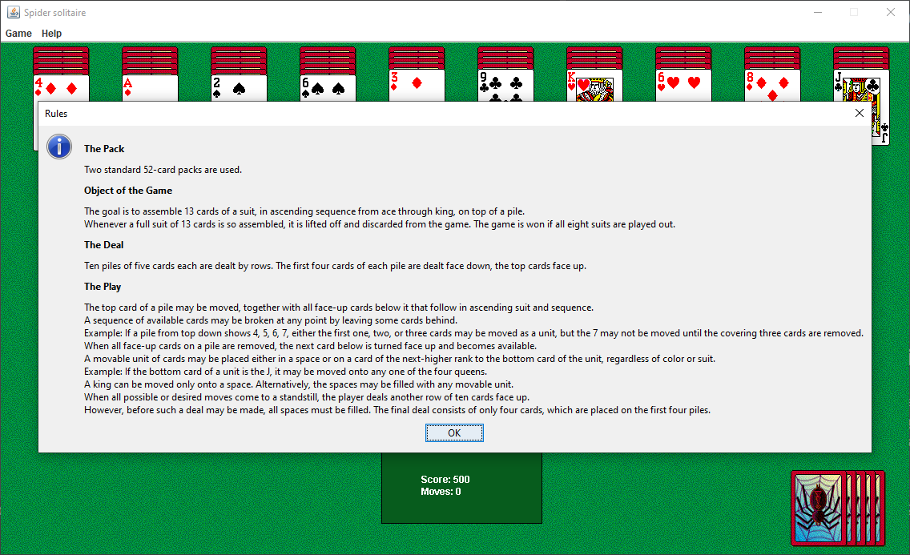

# Spider Solitaire game modelled on Microsoft's original game

## Clone of Microsoft's Spider solitaire
With Windows XP, I always like to play Spider Solitaire. 
The game was relaxing and addictive at the same time. 
Today while I'm using Windows 10, all solitaire games look so "polished" therefore, 
I decided to recreate the old good one XP Spider. 
The whole game is created on Java Swing.

### Screenshots

### TODO:
- ~~change randomization~~
- ~~game saveing~~
- ~~statistics~~
- ~~hints~~
- ~~sounds~~
- game options
- win animation

### TOFIX:
- fix animations